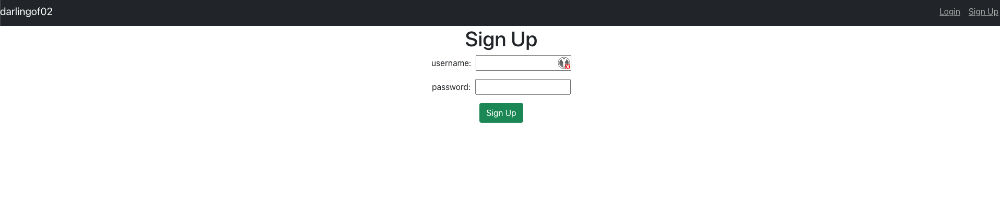
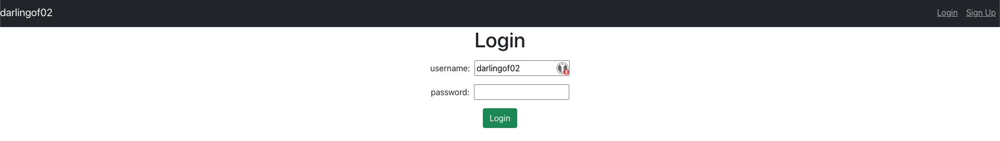
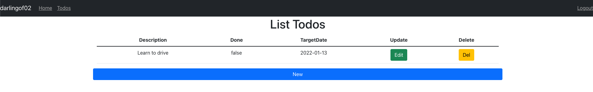
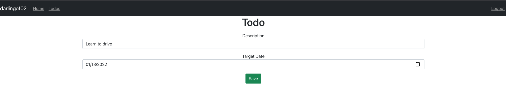

# Todo-App

## introduction

This is a simple web app built to keep a track of goals and serves mainly as a reminder for its users.

for backend implementation, references [here](https://github.com/darlingof02/restful-web-services)

## function

- sign up
  
- login
  
- view todos
  
- manage todos
  
